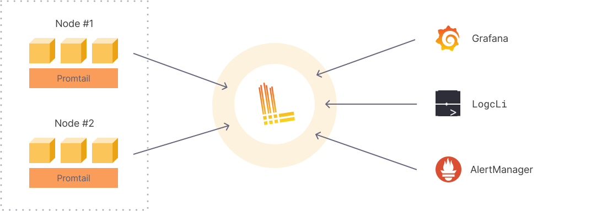
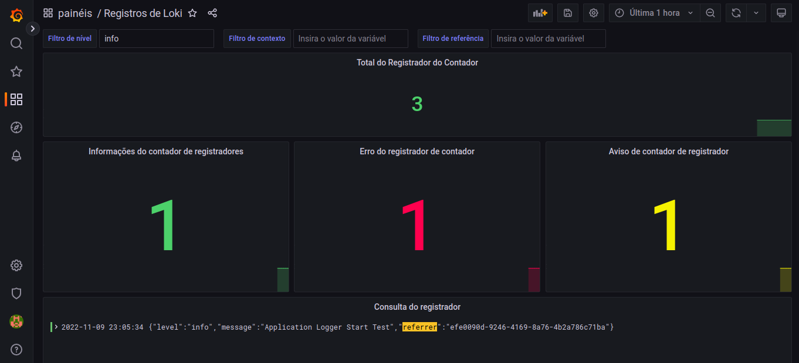

# Grafana Loki

## O que é o Grafana Loki?

O loki é um sistema centralização de logs, baseado no [Prometheus](https://prometheus.io/), projetado para ser simples e econômico.

## Benefícios

- Muito simples de usar;
- Tem gerador de alertas;
- Não requer uma formatação específica de logs;
- Integra - se nativamente ao Prometheus;
- Muito mais barato comparado com outros datasources para logs;
- Sintaxe de consulta simples;
- Muito mais;

---

## Como o Loki funciona?
<br/>
<div align="center">
    </img>
</div>

<br/>

1. Sua aplicação gera os logs em um arquivo de extenção `.log`;
2. O Promtail coleta os logs desses arquivos e envia para o `Grafana Loki`;
3. Através do [Grafana](https://grafana.com/), é possível consultar todos os seus logs com a linguagem `LogQL`;
4. Crie regras de alertas para que o Loki avalie os Logs recebidos;

---

## Bancos Suportados

Os bancos de dados suportados pelo Grafana Loki são:

- Cassandra;
- GCS;
- Files (arquivos salvos no sistema de arquivos, usados para testes e desenvolvimento local);
- S3;

---

## Rodando o projeto

Esse projeto simula um ambiente usando Docker para criar uma infraestrutura com:

- Grafana;
- Grafana Loki;
- Promtail;

Para esse exemplo, temos um arquivo feito em `JavaScript` utilizando a lib [winston](https://www.npmjs.com/package/winston) para criar alguns logs simples.

### Temos 3 `transporters` configurados com o winston:

- File;
- LokiTransport;
- Console;

### 1. Instale as dependências

```bash
$ npm install
```

### 2. Suba os containeres

```bash
$ docker-compose up -d
```

### 3 Inicie a aplicação

```bash
$ npm run start:dev
```

Feito isso, basta acessar o Grafana no link <a href="http://localhost:3001">http://localhost:3001</a> e acessar os logs através do dashboard configurado:

<div align="center">
    </img>
</div>

---

### Referências
- [Documentação Oficial](https://grafana.com/docs/loki/latest/)
- [Grafana Loki](https://grafana.com/oss/loki/)
- [Promtail](https://grafana.com/docs/loki/latest/clients/promtail/)
- [Labels in Loki](https://grafana.com/blog/2020/04/21/how-labels-in-loki-can-make-log-queries-faster-and-easier/)
- [Boas Práticas em logs](https://grafana.com/blog/2022/05/16/all-things-logs-best-practices-for-logging-and-grafana-loki/#the-one-thing-every-log-line-needs-to-have)
- [Correlacionar logs, métricas e traces](https://grafana.com/blog/2020/03/31/how-to-successfully-correlate-metrics-logs-and-traces-in-grafana/)